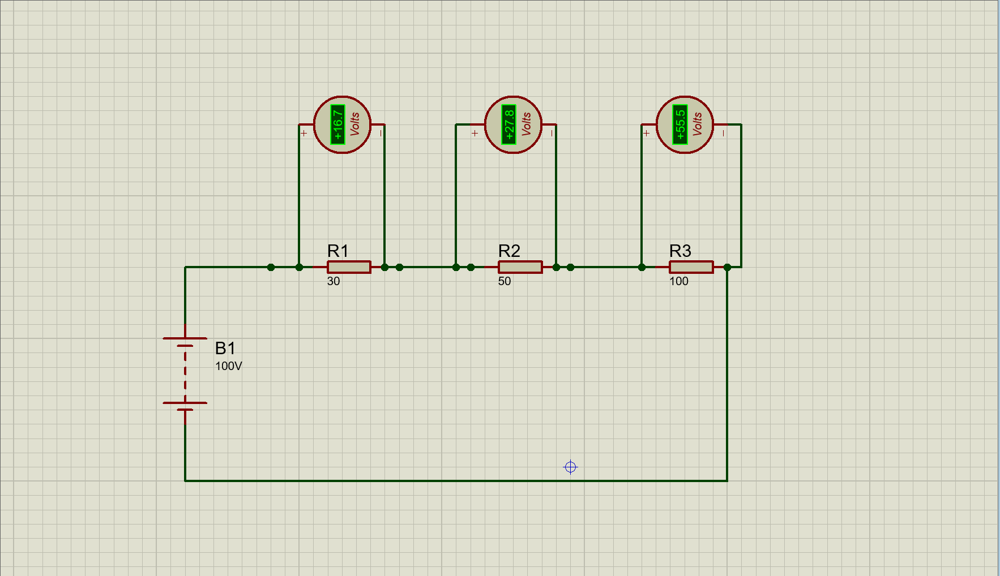

# BEEE-LAB

EXPT NO: 1	VERIFICATION OF KIRCHHOFF’S LAWS
AIM:

a.   To verify Kirchhoff’s Voltage Law (KVL) for the given circuit. 
b.   To verify Kirchhoff’s Current Law (KCL) for the given circuits.

APPARATUS REQUIRED:
S.No.	Components	Range	Quantity
1	Resistor	1kΩ	3
2	Voltmeter (DC)	0-30V	3
3	Ammeter (DC)	(0-200)mA	3
4	Bread Board		1
5	Regulated Power Supply	(0-30)V	1
6	Connecting wires		As required

THEORY:
KVL: Kirchhoff's voltage law states that the sum of the voltage differences around any closed loop in a circuit must be zero. A loop in a circuit is any path that ends at the same point at which it starts.
KCL:
Kirchhoff's Current Law (KCL) Kirchhoff's Current Law states that the algebraic sum of the currents entering and leaving a node is equal to zero. By convention, currents entering the node are positive, and those leaving a node are negative

PROCEDURE:
a.   KVL:
1.   Connect as per the circuit diagram.
2.   Check if the RPS voltage is set to zero voltage.
3.   Check all the meters for null position.
4.   Switch on the RPS.
5.   Set the input voltage to a value between 0V to 30V.
6.   Record the voltage values shown in the voltmeter connected across each resistor.
7.   Take readings for different values of input voltage and tabulate them.

b.  KCL:
1.   Connect as per the circuit diagram.
2.   Check if the RPS voltage is set to zero voltage.
3.   Check all the meters for null position.
4.   Switch on the RPS.
5.   Set the input voltage to a value between 0V to 30V.
6.   Record the voltage values shown in the ammeter connected to each resistor.
7.   Take readings for different values of input voltage and tabulate them. 
CIRCUIT DIAGRAM:

CIRCUIT DIAGRAM:

a.   KVL:
 

b.  KCL:
 

Calculation:

a.   KVL:
 
 

b.  KCL:

RESULT:

Thus, for the given circuit, Kirchhoff’s Laws, (a) KVL and (b) KCL are proved.
